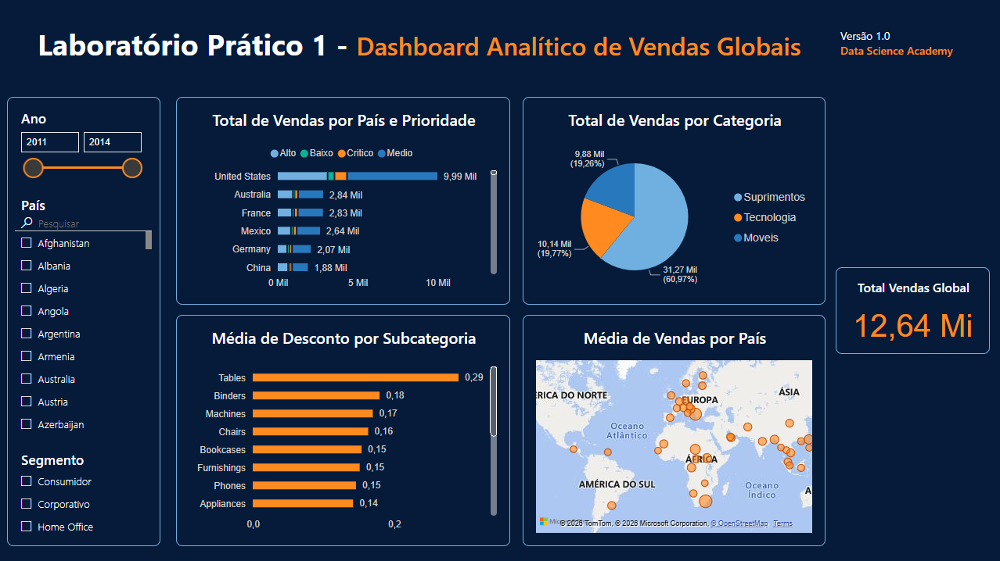

# Dashboard Analítico de Vendas Globais | Power BI

Projeto desenvolvido como parte da formação **Microsoft Power BI para Business Intelligence e Data Science**, da Data Science Academy.

## Sobre o projeto

O Laboratório Prático 1 propõe a construção de um dashboard analítico a partir de dados de vendas de uma empresa fictícia com atuação global.

O objetivo foi transformar os dados em uma visão interativa das vendas, permitindo analisar diferentes dimensões do desempenho comercial e responder a perguntas de negócio relacionadas a vendas, categorias de produtos, países, prioridade de entrega e descontos.

## Objetivos e perguntas de negócio

O dashboard foi desenvolvido para responder às seguintes perguntas propostas no laboratório:

1. Qual o valor total vendido?
2. Quantas vendas foram realizadas por categoria de produto?
3. Quantas vendas foram realizadas por país considerando a prioridade de entrega?
4. Qual foi a média de desconto nas vendas por subcategoria de produto?
5. Quais países tiveram maior média de valor de venda?

Além das análises, o relatório permite filtrar os dados por **ano, país e segmento**.

## Dashboard



O relatório foi construído em uma única página, com layout voltado para facilitar a leitura dos principais indicadores e comparações.

### Principais elementos

- **Total de Vendas Global:** cartão com a soma do campo `Total_Vendas`.
- **Total de Vendas por País e Prioridade:** gráfico de barras com a contagem de `ID_Pedido`, segmentada por país e prioridade de entrega.
- **Total de Vendas por Categoria:** gráfico de pizza com a contagem de `ID_Pedido` por categoria.
- **Média de Desconto por Subcategoria:** gráfico de barras com a média de `Desconto` por `SubCategoria`.
- **Média de Vendas por País:** mapa utilizando `Pais` como localização e a média de `Total_Vendas` como dimensão.
- **Filtros interativos:** ano, país e segmento.

## Dados utilizados

O modelo do relatório utiliza, entre outros, os seguintes campos diretamente nas visualizações:

| Campo | Utilização no dashboard |
|---|---|
| `Total_Vendas` | Soma no indicador global e média no mapa |
| `ID_Pedido` | Contagem de pedidos/vendas |
| `Pais` | Análises por país e mapa |
| `Prioridade` | Segmentação das vendas por prioridade de entrega |
| `Categoria` | Análise por categoria de produto |
| `SubCategoria` | Análise de descontos |
| `Desconto` | Cálculo da média de desconto |
| `Segmento` | Filtro interativo |
| `Data_Pedido` | Filtro por ano |

Os dados foram fornecidos no contexto do laboratório e representam uma empresa fictícia.

## Ferramenta

- Microsoft Power BI
- Power BI Desktop

## Recursos de visualização utilizados

O dashboard utiliza diferentes tipos de elementos visuais para apresentar as informações:

- Cartão/KPI
- Gráficos de barras
- Gráfico de pizza
- Mapa
- Segmentadores de dados (slicers)
- Formatação e organização visual do relatório

A página foi configurada em formato 16:9, com uma identidade visual baseada em fundo azul-escuro e elementos em laranja para destaque.

## Estrutura do projeto

```text
dashboard-vendas-globais-power-bi/
│
├── README.md
├── Lab 1.pbix
│
└── images/
    └── dashboard.png
```

## Como visualizar o projeto

1. Baixe o arquivo `Lab 1.pbix`.
2. Abra o arquivo utilizando o **Microsoft Power BI Desktop**.
3. Explore os filtros de ano, país e segmento.
4. Interaja com os gráficos para analisar as diferentes perspectivas das vendas.

## Resultado

O projeto consolida diferentes análises em um único dashboard interativo, permitindo explorar os dados de vendas globais por diferentes perspectivas.

No estado inicial apresentado no dashboard, o indicador de **Total Vendas Global** apresenta aproximadamente **12,64 milhões**.

Mais do que apresentar números, o projeto foi desenvolvido com o objetivo de organizar as informações de forma visual e interativa, facilitando a exploração dos dados e a identificação de padrões.

## Aprendizados

Este projeto contribuiu para a prática de:

- Construção de dashboards no Power BI;
- Seleção de visualizações de acordo com a pergunta de negócio;
- Uso de filtros e segmentadores;
- Análise de dados por diferentes dimensões;
- Criação de indicadores e agregações;
- Organização e formatação de uma página de relatório;
- Visualização geográfica de dados.

## Formação

Projeto desenvolvido durante a formação:

**Microsoft Power BI para Business Intelligence e Data Science**  
Data Science Academy

Este repositório apresenta um projeto educacional desenvolvido para fins de estudo e construção de portfólio.

---

Projeto 1 de 4 da série de dashboards desenvolvidos durante a formação.
